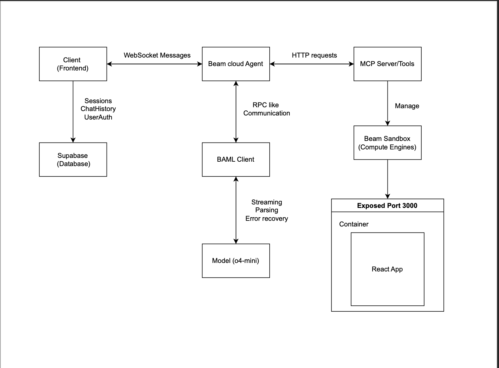
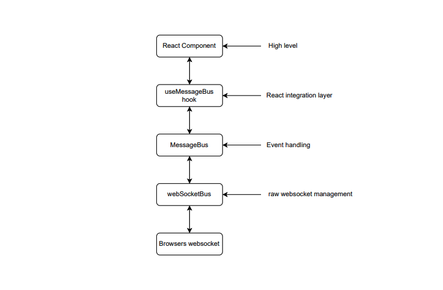

# 🚀 AuraCode - AI-Powered Web Development Platform

[](https://opensource.org/licenses/MIT)
[](https://www.python.org/downloads/)
[](https://nodejs.org/)
[](https://www.typescriptlang.org/)

AuraCode is a sophisticated AI-powered web development platform that enables real-time collaboration between developers and AI agents to build and modify web applications instantly. Inspired by modern AI coding assistants, it provides a complete development environment with live preview, code generation, and session persistence.


##  Key Features

### **AI-Powered Development**
- **Natural Language to Code**: Describe your app in plain English and watch AI generate React components
- **Real-time Code Generation**: Streaming AI responses with live code updates
- **Context-Aware Intelligence**: AI understands your entire project structure and maintains consistency
- **Multi-step Conversations**: Build complex features through iterative conversations

###  **Live Development Environment**
- **Instant Preview**: See changes immediately in a live iframe preview
- **Multi-device Testing**: Switch between mobile, tablet, and desktop views
- **Hot Reloading**: Automatic refresh when code updates are completed
- **Isolated Sandboxes**: Each project runs in its own secure container environment

###  **Session Management**
- **Persistent Projects**: Save and restore development sessions with full chat history
- **Project Dashboard**: Manage multiple projects with thumbnails and metadata
- **Session Restoration**: Continue exactly where you left off, including sandbox state
- **Chat History**: Complete conversation history preserved across sessions

###  **Modern UI/UX**
- **Responsive Design**: Works perfectly on desktop, tablet, and mobile devices
- **Real-time Chat**: Smooth chat interface with typing indicators and message streaming
- **Code Viewer**:code display with file tree navigation

###  **Security & Authentication**
- **Supabase Authentication**: Secure user management with Row Level Security (RLS)
- **Protected Routes**: Session-based access control
- **Secure Sandboxes**: Isolated execution environments prevent code interference
- **Environment Isolation**: Each user's projects are completely separated

##  Technical Architecture

AuraCode is built on a modern, scalable architecture with four core components:



### 1. **Frontend (React + TypeScript)**
- **React 18** with TypeScript for type safety
- **Vite** for fast development and building
- **React Router** for navigation
- **styled-components** for styling (migrating to modular CSS)
- **WebSocket** for real-time communication

### 2. **AI Agent (Python + WebSocket Server)**
- **BAML Client** for structured LLM communication
- **WebSocket Server** for real-time bidirectional communication
- **Message Bus Architecture** for scalable message routing
- **OpenAI GPT-4** for code generation and understanding

### 3. **MCP Server (Model Context Protocol)**
- **FastMCP** framework for tool orchestration
- **Beam Cloud Sandboxes** for isolated code execution
- **File System Operations** for code manipulation
- **Docker-based Environments** with pre-configured React setups

### 4. **Database & Authentication (Supabase)**
- **PostgreSQL** for data persistence
- **Row Level Security (RLS)** for multi-tenant data isolation
- **Real-time subscriptions** for live updates
- **JWT Authentication** with secure session management

##  WebSocket Communication Flow



The platform uses a sophisticated WebSocket communication system with multiple layers:

```typescript
// Message Flow Architecture
React Components → useMessageBus → MessageBus → WebSocketBus → AI Agent
                                                              ↓
Database ← Session Management ← MCP Server ← Sandbox Environment
```

### Message Types
- `INIT` - Initialize new sandbox or restore existing session
- `USER` - User chat messages sent to AI
- `AGENT_PARTIAL` - Streaming AI responses (real-time typing)
- `AGENT_FINAL` - Complete AI response
- `UPDATE_IN_PROGRESS` - Code modification in progress
- `UPDATE_COMPLETED` - Code changes applied successfully
- `CODE_DISPLAY_RESPONSE` - Code files for display in viewer

##  Tech Stack

### **Frontend Technologies**
- **React 18** - Modern React with concurrent features
- **TypeScript** - Type-safe JavaScript development
- **Vite** - Next-generation frontend tooling
- **React Router** - Declarative routing for React
- **styled-components** - CSS-in-JS styling solution
- **Lucide React** - Modern icon library
- **WebSocket API** - Real-time communication

### **Backend Technologies**
- **Python 3.12+** - Modern Python with latest features
- **FastMCP** - Model Context Protocol server framework
- **BAML** - Structured LLM communication library
- **WebSocket** - Real-time bidirectional communication
- **Beam Cloud** - Serverless platform for hosting and sandboxes

### **Database & Authentication**
- **Supabase** - Backend-as-a-Service platform
- **PostgreSQL** - Robust relational database
- **Row Level Security** - Database-level security policies
- **JWT Tokens** - Secure authentication mechanism

### **AI & Machine Learning**
- **OpenAI GPT-4** - Large language model for code generation
- **BAML Client** - Structured prompt engineering framework
- **Model Context Protocol** - Standardized AI tool interaction

### **Development & Deployment**
- **Docker** - Containerized sandbox environments
- **Beam Cloud** - Serverless deployment platform
- **Node.js 20** - JavaScript runtime for sandboxes
- **Vite Dev Server** - Fast development server with HMR

## Getting Started

### Prerequisites

Ensure you have the following installed:
- **Python 3.12+** - [Download Python](https://www.python.org/downloads/)
- **Node.js 20+** - [Download Node.js](https://nodejs.org/)
- **OpenAI API Key** - [Get API Key](https://platform.openai.com/api-keys)
- **Beam Cloud Account** - [Sign up](https://beam.cloud)
- **Supabase Account** - [Sign up](https://supabase.com)

### Installation

1. **Clone the Repository**
   ```bash
   git clone https://github.com/yourusername/auracode
   cd auracode
   ```

2. **Install Python Dependencies**
   ```bash
   # Using pip
   pip install -r requirements.txt
   
   # Or using uv (recommended for faster installs)
   uv sync
   ```

3. **Install Frontend Dependencies**
   ```bash
   cd frontend
   npm install
   # or
   yarn install
   ```

4. **Configure Environment Variables**
   
   Create `.env` in the frontend directory:
   ```bash
   cd frontend
   cp .env.template .env
   ```
   
   Update the `.env` file with your configuration:
   ```env
   VITE_BEAM_WS_URL=wss://your-agent-websocket-url
   VITE_BEAM_TOKEN=your-beam-api-token
   VITE_SUPABASE_URL=your-supabase-project-url
   VITE_SUPABASE_ANON_KEY=your-supabase-anon-key
   ```

5. **Set up Beam Secrets**
   ```bash
   beam secret create OPENAI_API_KEY your-openai-api-key
   beam secret create SUPABASE_URL your-supabase-url
   beam secret create SUPABASE_KEY your-supabase-service-key
   ```

### Running the Application

#### 1. Start the MCP Server
The MCP server manages sandbox environments and provides tools for the AI agent:

```bash
beam serve src/tools.py:s
```

This starts the FastMCP server with tools for:
- `create_app_environment` - Creates new React sandbox environments
- `load_code` - Retrieves code from existing sandboxes  
- `edit_code` - Updates code in sandbox environments
- `get_code_for_display` - Fetches code files for the code viewer

#### 2. Start the AI Agent
The agent handles real-time communication between the frontend and AI:

```bash
# Update src/agent.py with your MCP server URL first
beam serve src/agent.py:handler
```

#### 3. Run the Frontend
Start the development server:

```bash
cd frontend
npm run dev
# or
yarn dev
```

#### 4. Access the Application
Open your browser and navigate to `http://localhost:5173`

### Development Workflow

1. **Start Development Services**
   ```bash
   # Terminal 1 - MCP Server
   beam serve src/tools.py:s
   
   # Terminal 2 - AI Agent (update URL in src/agent.py first)
   beam serve src/agent.py:handler
   
   # Terminal 3 - Frontend
   cd frontend && npm run dev
   ```

2. **Make Changes**
   - Modify prompts in `baml_src/build.baml`
   - Update frontend components in `frontend/src`
   - Adjust AI logic in `src/agent.py`
   - Modify MCP tools in `src/tools.py`

3. **Generate BAML Clients** (after prompt changes)
   ```bash
   make generate
   ```

##  API Documentation

### WebSocket Messages

#### Client → Agent Messages

```typescript
// User message
{
  type: "USER",
  data: { text: "Create a login form with email and password" },
  timestamp: 1674123456789
}

// Initialize or restore sandbox
{
  type: "INIT", 
  data: { 
    sandbox_id?: "existing-sandbox-id",
    sessionId?: "session-uuid"
  }
}
```

#### Agent → Client Messages

```typescript
// Streaming AI response
{
  type: "AGENT_PARTIAL",
  data: { text: "I'll create a login form for you..." },
  id: "msg-uuid",
  timestamp: 1674123456789
}

// Environment initialization complete
{
  type: "INIT",
  data: {
    url: "https://sandbox-12345.beam.cloud",
    sandbox_id: "sb-12345"
  }
}

// Code update completed
{
  type: "UPDATE_COMPLETED",
  data: { 
    files: { "src/Login.tsx": "...", "src/styles.css": "..." }
  }
}
```

### REST API Endpoints

#### Sessions API (via Supabase)

```typescript
// Create new session
POST /rest/v1/sessions
{
  "title": "My New Project",
  "description": "A React dashboard app"
}

// Get user sessions
GET /rest/v1/sessions?user_id=eq.{userId}

// Update session
PATCH /rest/v1/sessions?id=eq.{sessionId}
{
  "sandbox_id": "sb-12345",
  "iframe_url": "https://sandbox-12345.beam.cloud"
}
```

#### Chat Messages API

```typescript
// Save message
POST /rest/v1/chat_messages
{
  "session_id": "session-uuid",
  "type": "USER",
  "content": "Create a dashboard",
  "sender": "USER"
}

// Get session messages
GET /rest/v1/chat_messages?session_id=eq.{sessionId}&order=timestamp.asc
```

### MCP Tools API

```python
# Create new sandbox environment
@mcp.tool
def create_app_environment() -> dict:
    """Creates a new React sandbox with Vite + TypeScript"""
    return {
        "url": "https://sandbox-xyz.beam.cloud",
        "sandbox_id": "sb-xyz123"
    }

# Load code from sandbox  
@mcp.tool
def load_code(sandbox_id: str) -> tuple[dict, str]:
    """Retrieves all source files from sandbox"""
    return file_map, package_json

# Update code in sandbox
@mcp.tool  
def edit_code(sandbox_id: str, code_map: dict) -> dict:
    """Updates multiple files in sandbox"""
    return {"sandbox_id": sandbox_id}
```

## 🏛️ System Architecture Details

### Frontend Architecture

```
src/
├── components/           # Reusable UI components
│   ├── ui/              # Base UI components (buttons, inputs)
│   ├── SessionCard.tsx  # Project cards on dashboard
│   ├── CodeViewer.tsx   # Syntax-highlighted code display
│   └── ...
├── screens/             # Page-level components
│   ├── Auth/           # Login/signup pages
│   ├── Create/         # Main development environment
│   └── New/            # Project dashboard
├── hooks/              # Custom React hooks
│   └── useMessageBus.ts # WebSocket communication hook
├── services/           # Core services
│   ├── messageBus.ts   # Message routing system
│   └── websocketBus.ts # WebSocket connection management
├── contexts/           # React contexts
│   └── AuthContext.tsx # Authentication state
├── lib/               # Utility libraries
│   ├── supabase.ts   # Database client
│   └── sessions.ts   # Session management
└── types/             # TypeScript type definitions
    └── messages.ts   # Message type definitions
```

### Backend Architecture

```
src/
├── agent.py           # Main AI agent WebSocket server
├── tools.py          # MCP server with sandbox tools
└── client.py         # BAML client configuration

baml_src/
└── build.baml        # AI prompts and schemas
```

### Communication Flow

1. **User Interaction** → Frontend captures user input
2. **WebSocket Message** → Sent to AI Agent via WebSocket
3. **AI Processing** → Agent uses BAML to communicate with OpenAI
4. **Code Generation** → AI generates code changes
5. **MCP Tool Execution** → Agent calls MCP server to update sandbox
6. **Live Update** → Sandbox serves updated app via iframe
7. **Database Persistence** → Session and messages saved to Supabase

### Database Schema

```sql
-- Users table (managed by Supabase Auth)
users (
  id uuid PRIMARY KEY,
  email text,
  created_at timestamptz
)

-- Project sessions
sessions (
  id uuid PRIMARY KEY,
  user_id uuid REFERENCES users(id),
  title text NOT NULL,
  description text,
  sandbox_id text,
  iframe_url text,
  is_active boolean DEFAULT false,
  created_at timestamptz DEFAULT now(),
  updated_at timestamptz DEFAULT now()
)

-- Chat message history
chat_messages (
  id uuid PRIMARY KEY,
  session_id uuid REFERENCES sessions(id),
  type text NOT NULL, -- 'USER', 'AGENT_PARTIAL', etc.
  content text NOT NULL,
  sender text NOT NULL, -- 'USER', 'ASSISTANT'
  message_data jsonb, -- Additional message metadata
  timestamp timestamptz DEFAULT now()
)
```

##  Security Features

- **Row Level Security (RLS)** - Database-level access control
- **JWT Authentication** - Secure token-based authentication  
- **Sandboxed Execution** - Isolated container environments
- **CORS Protection** - Cross-origin request security
- **Environment Isolation** - User projects completely separated
- **Secure WebSocket** - Authenticated real-time connections

##  Deployment

### Deploy to Beam Cloud

1. **Deploy MCP Server**
   ```bash
   beam serve src/tools.py:s --name auracode-mcp
   ```

2. **Deploy AI Agent** 
   ```bash
   beam serve src/agent.py:handler --name auracode-agent
   ```

3. **Deploy Frontend**
   ```bash
   cd frontend
   beam deploy frontend.py:handler --name auracode-frontend
   ```

### Environment Configuration

Set production environment variables:
```bash
beam secret create OPENAI_API_KEY your-production-key
beam secret create SUPABASE_URL your-production-url
beam secret create SUPABASE_KEY your-production-key
```

##  Contributing

We welcome contributions! Please see our [Contributing Guide](CONTRIBUTING.md) for details.

1. Fork the repository
2. Create a feature branch (`git checkout -b feature/amazing-feature`)
3. Commit your changes (`git commit -m 'Add amazing feature'`)
4. Push to the branch (`git push origin feature/amazing-feature`)
5. Open a Pull Request

## 📄 License

This project is licensed under the MIT License - see the [LICENSE](LICENSE) file for details.

##  Acknowledgments

- [Beam Cloud](https://beam.cloud) - Serverless platform and sandbox environments
- [BAML](https://github.com/BoundaryML/baml) - Structured LLM communication framework
- [Supabase](https://supabase.com) - Backend-as-a-Service platform
- [OpenAI](https://openai.com) - AI language models
- [Lovable.dev](https://lovable.dev) - Inspiration for the original concept

##  Troubleshooting

### Common Issues

**WebSocket Connection Failed**
- Ensure your Beam Cloud agent is running
- Check that the WebSocket URL in `.env` is correct
- Verify your Beam API token is valid

**Sandbox Creation Failed**  
- Confirm OpenAI API key is set correctly
- Check Beam Cloud account has sufficient credits
- Ensure MCP server is accessible from agent

**Authentication Issues**
- Verify Supabase URL and keys are correct
- Check RLS policies are properly configured
- Ensure user is properly authenticated

**Code Updates Not Reflecting**
- Try manually refreshing the iframe
- Check browser console for errors
- Verify sandbox is still running

